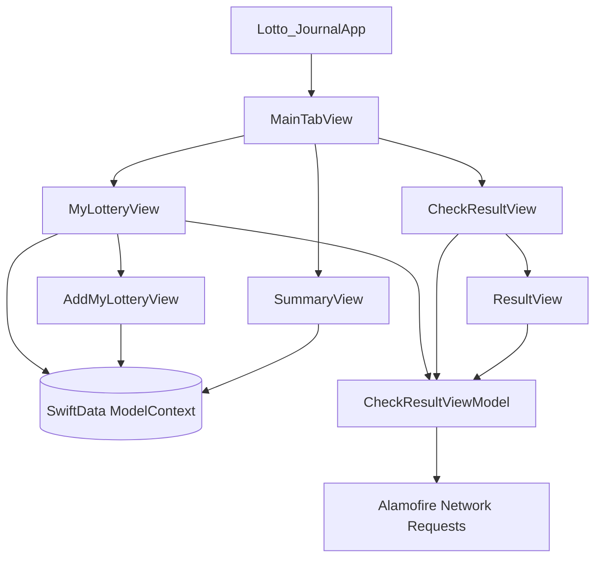

# Architecture Overview

## Current Architecture
The project follows modern **SwiftUI** architecture utilizing Swift 5 / Swift 6 concurrency, SwiftData persistence, `@Observable`, and Alamofire networking.

## State Management (`@Observable`)
- **`CheckResultViewModel`**: Decorated with `@Observable` and `@MainActor` (migrated from `ObservableObject` & `@Published`). Handles asynchronous API fetching with modern Swift structured concurrency (`async`/`await`), state mutations, and JSON parsing.
- **`QAService`**: Decorated with `@Observable` for Quick Action shortcut item routing across scenes.
- **SwiftUI Views**: Use `@State` to instantiate `@Observable` view models and `@Environment(QAService.self)` to consume application-level singletons.
- **SwiftData**: `@Query` is utilized in `MyLotteryView`, `AddMyLotteryView`, and `SummaryView` for reactive, persistent storage of `DrawDate` and `Lottery` entities.

## Concurrency & Lifecycle
- **View Lifecycle**: Network fetching uses SwiftUI `.task` and `.refreshable` lifecycle modifiers.
- **Parallel Requests**: `MyLotteryView` queries multiple draw dates concurrently using `withTaskGroup`.
- **Thread Safety**: UI-updating methods in `CheckResultViewModel` run on `@MainActor`.

---

## Detailed Screen Flows

### 1. Main Tab Navigation (`MainTabView`)
- Host container managing the 3 primary tabs:
  1. **My Lottery** (`MyLotteryView`)
  2. **Prize Result** (`CheckResultView`)
  3. **Summary** (`SummaryView`)
- Observes `QAService` to respond to 3D Touch / Quick Actions on the app icon (`AddLotteryAction`, `CheckResultAction`).

---

### 2. My Lottery Tab (`MyLotteryView`)
- **Purpose**: Displays user's logged lottery tickets categorized by draw date sections.
- **Features**:
  - List of `DrawDate` sections with tickets and win/loss badges.
  - Section headers displaying formatted draw titles ("Upcoming Draw", "Latest Draw", or localized draw date) alongside compact stats chips (total won vs. total invested).
  - Pull-to-refresh (`.refreshable`) triggers concurrent async refresh.
  - Navigation toolbar button opens `AddMyLotteryView` in a sheet with presentation detents.

---

### 3. Prize Result Tab (`CheckResultView`)
- **Purpose**: Allows users to inspect all official Thai lottery winning numbers for any draw date since 2010.
- **Components**:
  - **Liquid Glass Header Card**: Houses a `.compact` `DatePicker`, Previous/Next draw cycle stepper chevrons (`<` and `>`), and the **"Latest"** draw button.
  - **Prize Tables**: Clean hierarchy displaying First Prize, 3-Digit Prefix/Suffix, 2-Digit Suffix, Neighbors, 2nd, 3rd, 4th, and 5th prizes.
  - **Centered Empty State**: Displays `ContentUnavailableView` centered in the viewport when results are unavailable for a selected date.

---

### 4. Summary Tab (`SummaryView`)
- **Purpose**: Aggregates lifetime financial statistics from user's lottery history.
- **Metrics**: Total investment, total earnings, profit/loss balance, and win rates.
