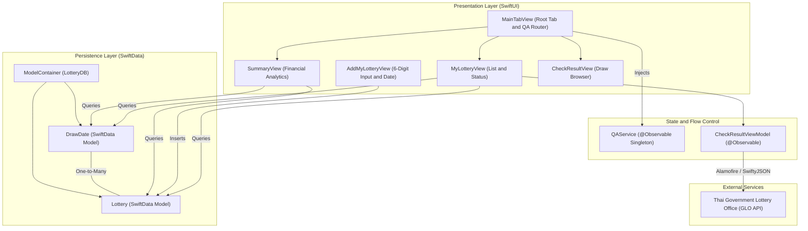
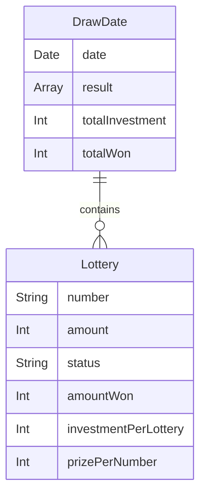
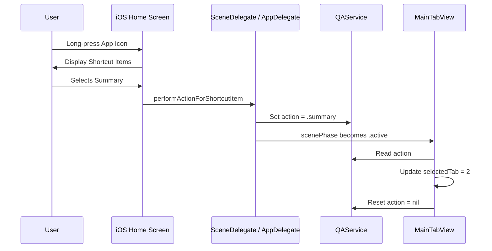

# Lotto Journal Architecture

This document provides a comprehensive technical overview of the architecture, design patterns, data flow, and external integrations in **Lotto Journal**.

---

## 1. Architecture Overview

Lotto Journal is designed following the **Model-View-ViewModel (MVVM)** architectural pattern, optimized for **SwiftUI** and Apple's **SwiftData** framework.



### Architectural Principles
- **Declarative & Reactive UI**: Built 100% in SwiftUI with modern reactive state propagation via `@Observable`, `@State`, `@Query`, and `@Environment`.
- **Offline-First Persistence**: Powered by SwiftData with on-device SQLite storage, enabling instant app launches and offline browsing of ticket history and past draws.
- **Single Source of Truth**: SwiftData `@Model` objects act as the source of truth for ticket collections; UI views reactively update when database models change.
- **Decoupled Quick Actions**: Deep-linking from iOS Home Screen shortcuts is routed through a dedicated `@Observable` `QAService` class to minimize coupling with UIKit lifecycle delegates.

---

## 2. Domain & Data Layer (SwiftData)

### Entity Relationship Diagram



### Key Models

#### [`DrawDate`](Lotto%20Journal/Models/DrawDate.swift)
- **Role**: Represents an official Thai lottery draw date (ordinarily the 1st or 16th of each month).
- **Relationships**: Owns a one-to-many relationship with [`Lottery`](Lotto%20Journal/Models/Lottery.swift).
- **Responsibilities**:
  - Encapsulates API payload generation (`params`) formatted for GLO network requests.
  - Caches raw draw verification JSON (`result: [JSON]`).
  - Computes aggregate metrics: `totalInvestment` and `totalWon` across all associated tickets.

#### [`Lottery`](Lotto%20Journal/Models/Lottery.swift)
- **Role**: Represents an individual logged lottery entry.
- **Attributes**:
  - `number`: 6-digit lottery number string (e.g., `"530451"`).
  - `amount`: Number of matching tickets purchased.
  - `status`: Lifecycle state (`.isWaiting`, `.doesWon`, `.doesNotWon`).
  - `amountWon`: Payout for a single winning ticket under this number.
  - `drawDate`: Inverse relationship to `DrawDate` (`deleteRule: .nullify`).
- **Computed Domain Logic**:
  - `investmentPerLottery`: Calculates total spending (`amount * 80฿`).
  - `prizePerNumber`: Total return (`amountWon * amount`).
  - `tagSymbol` & `tagColor`: Visual badges displayed in SwiftUI lists.

#### [`Prize`](Lotto%20Journal/Models/Prize.swift)
An enum encoding the official payout structure of the Thai Government Lottery:

| Prize Tier | Enum Case | Official Thai Name | Single Payout (THB) |
| :--- | :--- | :--- | :--- |
| First Prize | `.first` | รางวัลที่ 1 | ฿6,000,000 |
| First Prize Neighbors | `.firstNB` | รางวัลข้างเคียงรางวัลที่ 1 | ฿100,000 |
| Second Prize | `.second` | รางวัลที่ 2 | ฿200,000 |
| Third Prize | `.third` | รางวัลที่ 3 | ฿80,000 |
| Fourth Prize | `.fourth` | รางวัลที่ 4 | ฿40,000 |
| Fifth Prize | `.fifth` | รางวัลที่ 5 | ฿20,000 |
| 3-Digit Prefix | `.threePre` | รางวัลเลขหน้า 3 ตัว | ฿4,000 |
| 3-Digit Suffix | `.threeSuf` | รางวัลเลขท้าย 3 ตัว | ฿4,000 |
| 2-Digit Suffix | `.twoSuf` | รางวัลเลขท้าย 2 ตัว | ฿2,000 |

---

## 3. Network & External Integration Layer

Communication with the **Government Lottery Office (GLO)** is orchestrated by [`CheckResultViewModel`](Lotto%20Journal/ViewModels/CheckResultViewModel.swift) using **Alamofire** and **SwiftyJSON**.

### API Endpoints

```
Base URL: https://www.glo.or.th
```

| Endpoint | Method | Purpose | Payload Parameters |
| :--- | :--- | :--- | :--- |
| `/api/lottery/getLatestLottery` | `POST` | Fetches the most recent official draw date and winning numbers | None |
| `/api/checking/getLotteryResult` | `POST` | Fetches all winning numbers for a specified draw date | `period_date` (`ddMMyyyy` in Buddhist Era) |
| `/api/checking/getcheckLotteryResult` | `POST` | Validates a batch of ticket numbers against a specific draw date | `number: [[lottery_num: String]]`, `period_date: String` |

### Calendar & Date Handling

The Thai lottery operates on the **Buddhist Calendar (BE)**, which is 543 years ahead of the Gregorian calendar (CE).
- [`DateExtension.swift`](Lotto%20Journal/Extensions/DateExtension.swift) provides date transformation utilities:
  - Formats dates as `ddMMyyyy` in Buddhist Era (e.g., `01062567` for June 1, 2024) using `th_TH` locale and `Calendar(identifier: .buddhist)`.
  - Calculates upcoming and previous draw dates based on the fixed 1st and 16th schedule.
  - Normalizes timestamps to midnight UTC to prevent time-offset mismatches when querying draw dates.

---

## 4. Presentation & User Experience Flow

```
┌────────────────────────────────────────────────────────┐
│                      MainTabView                       │
└───────┬───────────────────────┼────────────────┬───────┘
        │ Tab 1                 │ Tab 2          │ Tab 3
┌───────▼──────────────┐ ┌──────▼────────┐ ┌─────▼───────────────┐
│    MyLotteryView     │ │  SummaryView  │ │  CheckResultView    │
│                      │ │               │ │                     │
│ • Grouped Draw Lists │ │ • Net P/L (฿) │ │ • Date Picker (BE)  │
│ • Live Status Badges │ │ • Win Rate %  │ │ • Search Number     │
│ • Swipe Deletion     │ │ • Spending    │ │ • Full Prize Board  │
│ • Add Ticket Sheet   │ │ • Prize Won   │ │                     │
└──────────────────────┘ └───────────────┘ └─────────────────────┘
```

### 1. Ticket Verification Flow
1. User launches the app or triggers pull-to-refresh on `MyLotteryView`.
2. `CheckResultViewModel.latestResultAPI()` fetches the latest confirmed draw date.
3. For each `DrawDate` in SwiftData, `updateResultAPI(param:)` sends ticket numbers to GLO.
4. Response rewards are evaluated in `updateLotteryStatus(for:with:on:latestResultDate:)`:
   - If ticket is awaiting a future draw: Status remains `.isWaiting`.
   - If ticket matches a prize string: Status becomes `.doesWon` and `amountWon` is populated.
   - If ticket did not match any prize: Status becomes `.doesNotWon`.

### 2. Financial Analytics Flow
1. `SummaryView` queries all stored `DrawDate` and `Lottery` records via `@Query`.
2. Computes total spending (`sum(lottery.amount * 80)`).
3. Computes total return (`sum(lottery.amountWon * lottery.amount)`).
4. Computes net profit/loss and winning percentage (`wonCount / totalBought * 100`).
5. Updates cards and widgets with color-coded profit indicators (`.customGreen` vs. `.customRed`).

---

## 5. Quick Actions & Deep Linking



Home Screen Quick Actions are configured via `UIApplicationShortcutItem` in `Info.plist`:
- `myLottery`: Navigates to Tab 1 (`MyLotteryView`).
- `summary`: Navigates to Tab 2 (`SummaryView`).
- `result`: Navigates to Tab 3 (`CheckResultView`).

The `QAService` `@Observable` class bridges the UIKit delegate lifecycle (`SceneDelegate` / `AppDelegate`) to the SwiftUI declarative hierarchy via `@Environment(QAService.self)`.

---

## 6. Future Architectural Roadmap

### Modernization & Refactoring
- **Async/Await Networking**: Migrate Alamofire and SwiftyJSON to native `URLSession` with Swift `async/await` and `Codable` structs, aligning with modern Swift Concurrency.
- **Repository Pattern**: Abstract network requests behind a `LotteryRepositoryProtocol` to facilitate mock-based unit testing.

### Feature Enhancements
- **Vision OCR Scanning**: Utilize Apple's `Vision` framework (`VNRecognizeTextRequest`) to allow users to scan 6-digit lottery tickets using the device camera.
- **WidgetKit Integration**: Add Home Screen and Lock Screen widgets showing latest draw winning numbers and countdown to the next draw.
- **Background Refresh**: Implement `BGAppRefreshTask` to automatically check tickets on draw afternoons (1st & 16th at ~16:00 TH) and deliver local push notifications for wins.
