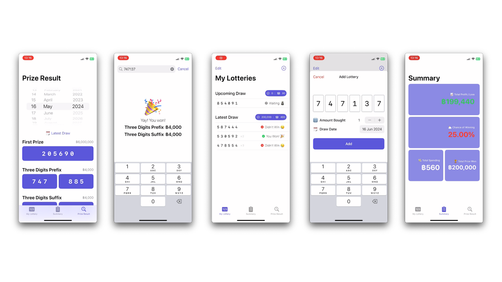
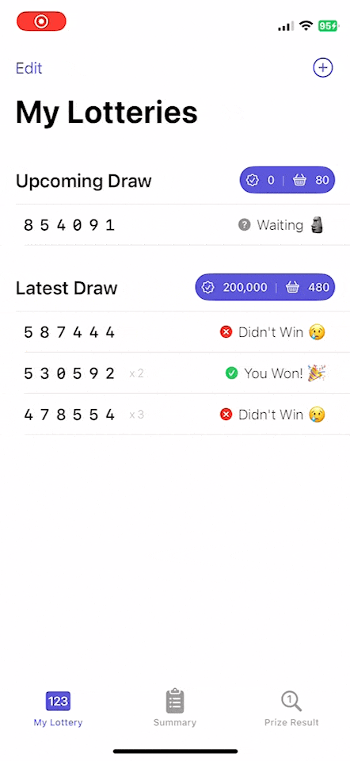

# Lotto Journal

A native iOS Thai Lottery Journal and Tracker application built with **SwiftUI** and **SwiftData**.

<p align="center">
  
  
</p>

---

## 📖 Overview

**Lotto Journal** helps users log, track, and automatically verify their Thai Government Lottery (สลากกินแบ่งรัฐบาล) tickets. With automatic result verification against official Thai Government Lottery Office (GLO) endpoints, financial tracking (profit/loss & win rates), and historical draw lookups, Lotto Journal turns lottery journaling into a clean, modern iOS experience.

---

## ✨ Key Features

- **Ticket Journaling & Management**: Log 6-digit lottery numbers with ticket counts, customized date pickers aligned with official draw cycles (1st & 16th of each month), and swipe-to-delete.
- **Automated Result Verification**: Automatically queries the official GLO API to check ticket numbers and determine winning prize tiers and payouts.
- **Investment & P/L Summary**: Real-time financial dashboard displaying:
  - Net Profit / Loss (฿)
  - Winning Percentage / Probability Rate (%)
  - Total Spending (based on official ฿80/ticket base)
  - Total Prize Won
- **Historical Result Checker**: Browse complete winning numbers for any draw date dating back to March 2010.
- **Home Screen Quick Actions**: 3D Touch / Haptic Touch shortcut items on the app icon to jump straight into *My Lottery*, *Summary*, or *Prize Result*.
- **Localization**: Full bilingual support for **English** and **Thai** via Swift String Catalogs (`.xcstrings`).

---

## 🏛️ Codebase Architecture

Lotto Journal follows a **SwiftUI MVVM (Model-View-ViewModel)** architectural pattern integrated with **SwiftData** for local persistence and Apple's **Observation** framework (`@Observable`).

> 📖 **Deep Dive**: For full ER diagrams, detailed sequence flows, and GLO API specifications, refer to [**ARCHITECTURE.md**](Lotto%20Journal/ARCHITECTURE.md).

```
┌────────────────────────────────────────────────────────┐
│                      UI (SwiftUI)                      │
│   MainTabView ── MyLotteryView ── SummaryView ── ...   │
└───────────────▲────────────────────────▲───────────────┘
                │                        │
       @Query / SwiftData               │ @Observable / @State
                │                        │
┌───────────────▼──────────────┐ ┌───────▼───────────────┐
│     Persistence (SwiftData)  │ │      ViewModels       │
│  DrawDate  ◄──►  Lottery     │ │ CheckResultViewModel │
└──────────────────────────────┘ └───────┬───────────────┘
                                         │ Alamofire + SwiftyJSON
                                 ┌───────▼───────────────┐
                                 │   GLO Lottery API     │
                                 └───────────────────────┘
```

### 1. Data Layer (`Models/`)
- [`DrawDate.swift`](Lotto%20Journal/Models/DrawDate.swift): SwiftData `@Model` representing a lottery draw event (1st or 16th of each month). Holds a one-to-many relationship with `Lottery` models and cached GLO API result JSON. Computes `totalInvestment` and `totalWon` per draw.
- [`Lottery.swift`](Lotto%20Journal/Models/Lottery.swift): SwiftData `@Model` representing a purchased lottery ticket (6-digit number, quantity, status `.isWaiting` / `.doesWon` / `.doesNotWon`, and amount won).
- [`Prize.swift`](Lotto%20Journal/Models/Prize.swift): Enum defining Thai lottery prize categories (1st, Neighbors, 2nd, 3rd, 4th, 5th, 3-digit prefix/suffix, 2-digit suffix) along with official payout amounts and localized Thai names.
- [`Result.swift`](Lotto%20Journal/Models/Result.swift): Struct model capturing parsed response payloads from the GLO API.

### 2. ViewModel & Networking (`ViewModels/`)
- [`CheckResultViewModel.swift`](Lotto%20Journal/ViewModels/CheckResultViewModel.swift): `@Observable` view model communicating with the official GLO API via Alamofire and SwiftyJSON.
  - `numberSearchAPI`: Verifies specific ticket numbers against a selected draw date.
  - `drawDateResultAPI`: Fetches all winning prize tiers for a specific draw date.
  - `latestResultAPI`: Retrieves the latest draw date and winning numbers.

### 3. Presentation Layer (`Views/`)
- **Main / Navigation**:
  - [`Lotto_JournalApp.swift`](Lotto%20Journal/Lotto_JournalApp.swift): App entry point configuring the SwiftData `ModelContainer` for `DrawDate`.
  - [`MainTabView.swift`](Lotto%20Journal/Views/MainTabView.swift): Main navigation controller handling tab selection and routing incoming Home Screen Quick Actions.
- **Pages**:
  - [`MyLotteryView.swift`](Lotto%20Journal/Views/MyLotteryView.swift): Displays logged lotteries grouped by draw date using `@Query`, triggers background verification against GLO API, and handles deletions.
  - [`AddMyLotteryView.swift`](Lotto%20Journal/Views/AddMyLotteryView.swift): Modal sheet for entering 6-digit tickets using OTPView, selecting quantity, and associating with a draw date.
  - [`SummaryView.swift`](Lotto%20Journal/Views/SummaryView.swift): Analytics dashboard displaying P/L cards, win rate percentage, and spending vs. prize won widgets.
  - [`CheckResultView.swift`](Lotto%20Journal/Views/CheckResultView.swift) & [`ResultView.swift`](Lotto%20Journal/Views/ResultView.swift): Public draw checker allowing users to inspect winning numbers by date or search numbers.
- **Components**: Reusable views for prize headers, individual numbers, and metric widgets ([`PrizeHeaderView.swift`](Lotto%20Journal/Views/PrizeHeaderView.swift), [`PrizeNumberView.swift`](Lotto%20Journal/Views/PrizeNumberView.swift), [`SummaryWidgetHalfView.swift`](Lotto%20Journal/Views/SummaryWidgetHalfView.swift)).

### 4. Quick Actions (`QuickActions/`)
- [`QuickActionType.swift`](Lotto%20Journal/QuickActions/QuickActionType.swift): Defines `UIApplicationShortcutItem` types and provides `@Observable` `QAService` singleton to forward shortcut selections to SwiftUI.
- [`AppDelegate.swift`](Lotto%20Journal/QuickActions/AppDelegate.swift) & [`SceneDelegate.swift`](Lotto%20Journal/QuickActions/SceneDelegate.swift): Intercepts shortcut item invocations when launching or resuming from background.

### 5. Utilities & Extensions (`Extensions/`)
- [`DateExtension.swift`](Lotto%20Journal/Extensions/DateExtension.swift): Handles Thai lottery calendar rules (calculating next/upcoming draw dates on 1st & 16th, formatting dates in Buddhist Era `th_TH`, period strings `ddMMyyyy`).
- [`IntExtension.swift`](Lotto%20Journal/Extensions/IntExtension.swift) & [`StringExtension.swift`](Lotto%20Journal/Extensions/StringExtension.swift): Number formatting with comma delimiters (`1000` -> `1,000`) and date parsers.

---

## 📁 Project Directory Structure

```text
lotto-journal/
├── Lotto Journal/
│   ├── Models/                     # SwiftData entities & business models
│   │   ├── DrawDate.swift          # @Model for lottery draw date
│   │   ├── Lottery.swift           # @Model for individual ticket
│   │   ├── Prize.swift             # Prize tier definitions & payouts
│   │   └── Result.swift            # API response data structure
│   ├── ViewModels/                 # @Observable ViewModels
│   │   └── CheckResultViewModel.swift # GLO network operations
│   ├── Views/                      # Screen-level and component views
│   │   ├── MainTabView.swift       # Tab bar navigation & routing
│   │   ├── MyLotteryView.swift     # Logged lottery ticket list
│   │   ├── AddMyLotteryView.swift  # Add ticket sheet
│   │   ├── SummaryView.swift       # Analytics dashboard
│   │   ├── CheckResultView.swift   # Draw result search
│   │   ├── ResultView.swift        # Full winning numbers board
│   │   └── Components/             # Sub-views (widgets, prize headers)
│   ├── QuickActions/               # 3D Touch / Shortcut items handling
│   ├── Extensions/                 # Date, Int, and String utilities
│   ├── Assets.xcassets             # Colors, Icons, and Images
│   ├── Localizable.xcstrings       # Localization string catalog (EN, TH)
│   └── Lotto_JournalApp.swift      # Main application entry point
├── Demo/                           # Screenshots and demo assets
├── ARCHITECTURE.md                 # Technical architecture & design documentation
├── LICENSE                         # License terms
└── README.md                       # Project overview & documentation
```

---

## 🛠️ Tech Stack & Dependencies

- **Language & Framework**: Swift 5.9+ / Swift 6, SwiftUI
- **Local Persistence**: [SwiftData](https://developer.apple.com/documentation/swiftdata)
- **Observation**: [Observation Framework](https://developer.apple.com/documentation/observation) (`@Observable`)
- **Networking**: [Alamofire](https://github.com/Alamofire/Alamofire)
- **JSON Parsing**: [SwiftyJSON](https://github.com/SwiftyJSON/SwiftyJSON)
- **UI Components**: [otpview-swiftui](https://github.com/mukeshsolanki/otpview-swiftui) (adapted for 6-digit lottery input)
- **API**: Official Thai Government Lottery Office ([GLO](https://www.glo.or.th)) public endpoints

---

## 🚀 Getting Started

### Prerequisites
- macOS Sequoia (15.0+) or later
- Xcode 16.0+ (or Xcode 26.0+)
- iOS 26.6+ deployment target (compatible with SwiftData and Observation)

### Installation
1. Clone the repository:
   ```sh
   git clone https://github.com/mmmmmob/lotto-journal.git
   cd lotto-journal
   ```
2. Open the project in Xcode:
   ```sh
   open "Lotto Journal.xcodeproj"
   ```
3. Allow Xcode to resolve Swift Package Manager (SPM) dependencies.
4. Select an iOS Simulator or physical device (iOS 26.6+) and click **Run** (`Cmd + R`).

---

## 📄 License

Lotto Journal © 2024 by Theppitak M. is licensed under [CC BY-NC-SA 4.0](https://creativecommons.org/licenses/by-nc-sa/4.0/). See the [`LICENSE`](LICENSE) file for full details.
